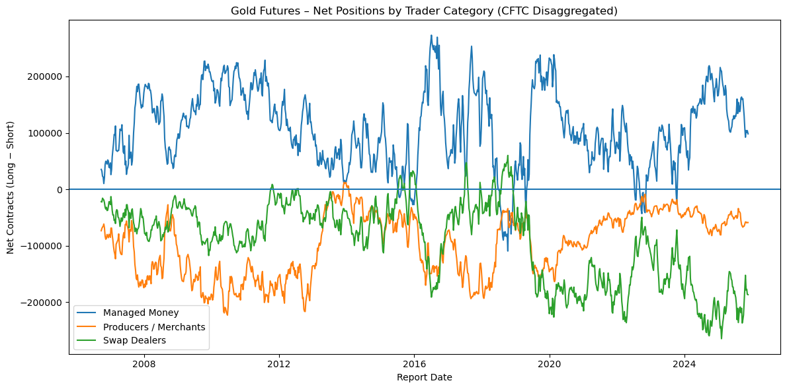

# data-sourcing-and-apis
data sourcing and apis


# 📊 CFTC Commitments of Traders — Gold Futures Positioning

This project analyzes **CFTC Commitments of Traders (COT)** data for **Gold futures**, focusing on how different trader categories position themselves over time.

Using the **Disaggregated Futures Only** report via the CFTC’s public API, the analysis computes and visualizes **net positions** (long − short) for key market participants.

---

## 🔍 What this project does
- Pulls regulatory futures data from the **CFTC public reporting API** (Socrata / SODA)
- Filters to **Gold futures** contracts
- Cleans and structures weekly positioning data
- Engineers **net exposure metrics** for:
  - Producer / Merchant
  - Swap Dealers
  - Managed Money
- Visualizes positioning trends through time

---

## 📈 Example output



---

## 🧠 Why this matters
COT positioning is widely used by:
- macro investors
- commodity traders
- quantitative researchers  

Net positioning helps identify:
- speculative crowding
- hedging pressure
- structural shifts in market participation

---

## 🗂 Repository structure
```text
.
├── notebooks/
│ └── 01_cftc_gold_disaggregated.ipynb # polished end-to-end analysis
├── scratch/
│ └── 00_html_table_extraction.ipynb # exploratory API / data experiments
├── assets/
│ └── gold_net_positions.png
├── README.md
├── requirements.txt
└── LICENSE
```

**Note:**  
`scratch/` contains exploratory notebooks used during development (API probing, schema discovery, data acquisition experiments). The main analysis lives in `notebooks/`.

---

## 🛠 Tech stack
- Python
- requests
- pandas
- matplotlib
- Jupyter Notebook

---

## 🔮 Future extensions
- Parameterize commodity selection (any CFTC contract)
- Normalize positioning by open interest
- Add z-score / percentile-based positioning signals
- Integrate weather or macroeconomic data for agricultural commodities

---

## 📌 Data source
- U.S. Commodity Futures Trading Commission (CFTC)
- Commitments of Traders — Disaggregated Futures Only Report
